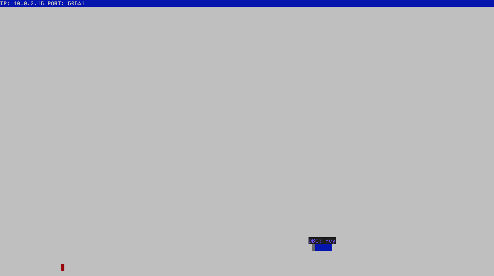
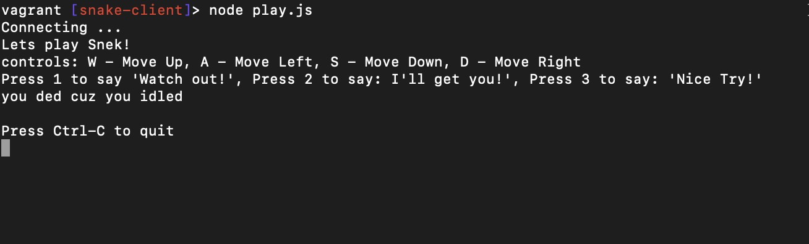

# Snake Client Project

Snake game is a very popular video game. It is a video game concept where the player maneuvers a dot and grows it by ‘eating’ pieces of food. As it moves and eats, it grows and the growing snake becomes an obstacle to smooth maneuvers. The goal is to grow it to become as big as possible without bumping into the side walls, or bumping into itself, upon which it dies.

This is simply a multiplayer take on the genre.

Before you can run this client, you will need to be running the server side which you can download and install from [here](https://github.com/lighthouse-labs/snek-multiplayer). 

## Final Product





## Getting Started

- Follow steps inside the snek server repo to run the server side
- Run the development snake client using the `node play.js` command.
- To change player name, the player must change name string in client.js 
  ```conn.write("Name: DBC");```

## How to Play
- Movement Controls: `WASD` Keys to move `Up/Left/Down/Right` 
- Snek will continue to move in direction commanded until new movement key pressed.
- Snek cannot reverse directions
- Snek will grow as it eats dots
- If no movement key is pressed game ends for Idle
- If snek contacts itself, another players snek, or the sides of the board, snek dies
- Press `1`, `2`, `3` for playful messages
- Press `Ctrl-C` to quit the game